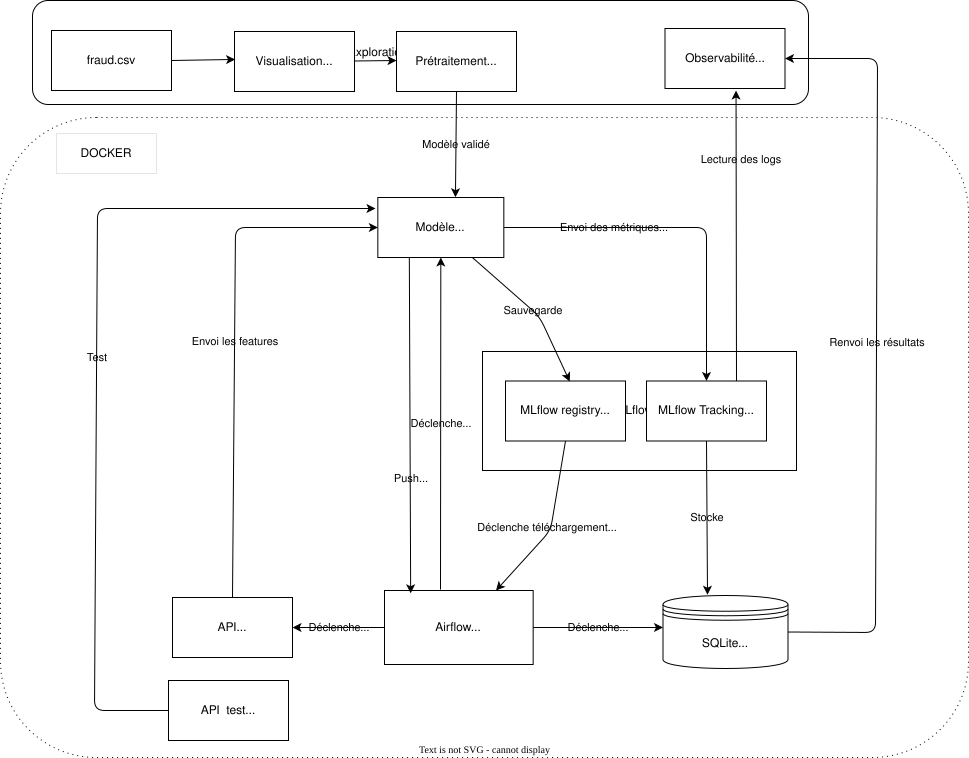

# Conception de l'architecture

L'architecture technique du projet est conçue pour répondre aux exigences d'automatisation, de scalabilité et de gouvernance des données dans un contexte de détection de fraude.

## Schéma de l'Infrastructure

### Justification des Choix Techniques

L'architecture repose sur une approche micro-services conteneurisée, structurée en trois phases clés pour garantir un passage fluide de l'expérimentation à l'industrialisation.

1. Environnement de Développement (Local)
**Outils :** Jupyter Notebooks (EDA, Modélisation), Scripts Python.

**Raison du choix :** Isoler la phase de recherche (Data Science) du pipeline de production. L'exportation des modèles au format .pkl assure la portabilité de l'intelligence artificielle vers l'infrastructure d'orchestration.

2. Orchestration et Automatisation (Airflow & Docker)

**Outils :** Apache Airflow, Docker, Docker-compose.

**Raison du choix :**

* Automatisation : Airflow pilote le flux ETL (Extraction depuis l'API, Transformation, Inférence) de manière autonome.
* Scalabilité : La conteneurisation permet de scaler horizontalement les services (ex: augmenter le nombre de workers pour traiter de gros volumes).
* Fault Tolerance : L'utilisation de volumes persistants garantit qu'aucune donnée de prédiction ou de tracking n'est perdue en cas de redémarrage d'un service.

3. Gouvernance et Observabilité (MLflow & SQLite)

**Outils :** MLflow, SQLite, Notebook de Monitoring.

**Raison du choix :**

* Traçabilité : MLflow centralise le versioning des modèles, répondant aux exigences d'auditabilité.
* Boucle de Feedback : Le croisement des données de production (SQL) avec les métriques théoriques (MLflow) permet de monitorer le Data Drift et de garantir la qualité des données dans le temps.

### Vision industrielle et souveraineté

Bien que ce projet soit présenté sous forme de POC, l'architecture a été pensée pour évoluer vers un environnement Enterprise-grade :

**Souveraineté & RGPD :** Le pipeline est agnostique. Il peut être déployé On-Premise (Datacenter privé) pour une souveraineté totale des données sensibles, ou sur un Cloud Souverain pour concilier agilité et conformité au RGPD (protection contre le Cloud Act).

**Évolution Cloud Native :** La structure actuelle facilite une migration vers Kubernetes pour une gestion massive des flux et une intégration CI/CD permettant le ré-entraînement automatique du modèle en cas de drift.

**Note sur la Sécurité :** L'architecture respecte le principe de minimisation des données. Seules les caractéristiques techniques nécessaires à la prédiction sont persistées, excluant toute donnée nominative non cryptée.
