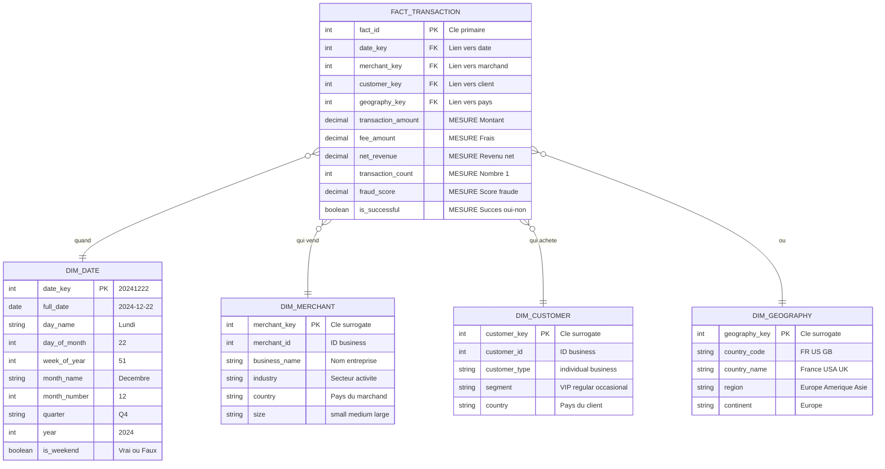

# Conception de schéma pour un système OLAP

## Schéma

```mermaid
    erDiagram
    %% SCHÉMA EN ÉTOILE SIMPLIFIÉ
    %% Au centre : la table de FAITS (mesures)
    %% Autour : les DIMENSIONS (contexte pour analyser)
    
    FACT_TRANSACTION }o--|| DIM_DATE : "quand"
    FACT_TRANSACTION }o--|| DIM_MERCHANT : "qui vend"
    FACT_TRANSACTION }o--|| DIM_CUSTOMER : "qui achete"
    FACT_TRANSACTION }o--|| DIM_GEOGRAPHY : "ou"
    
    %% TABLE DE FAITS - Les mesures à analyser
    FACT_TRANSACTION {
        int fact_id PK "Cle primaire"
        int date_key FK "Lien vers date"
        int merchant_key FK "Lien vers marchand"
        int customer_key FK "Lien vers client"
        int geography_key FK "Lien vers pays"
        decimal transaction_amount "MESURE Montant"
        decimal fee_amount "MESURE Frais"
        decimal net_revenue "MESURE Revenu net"
        int transaction_count "MESURE Nombre 1"
        decimal fraud_score "MESURE Score fraude"
        boolean is_successful "MESURE Succes oui-non"
    }
    
    %% DIMENSION TEMPS - Pour analyser par période
    DIM_DATE {
        int date_key PK "20241222"
        date full_date "2024-12-22"
        string day_name "Lundi"
        int day_of_month "22"
        int week_of_year "51"
        string month_name "Decembre"
        int month_number "12"
        string quarter "Q4"
        int year "2024"
        boolean is_weekend "Vrai ou Faux"
    }
    
    %% DIMENSION MARCHAND - Dénormalisée pour performance
    DIM_MERCHANT {
        int merchant_key PK "Cle surrogate"
        int merchant_id "ID business"
        string business_name "Nom entreprise"
        string industry "Secteur activite"
        string country "Pays du marchand"
        string size "small medium large"
    }
    
    %% DIMENSION CLIENT - Segmentation
    DIM_CUSTOMER {
        int customer_key PK "Cle surrogate"
        int customer_id "ID business"
        string customer_type "individual business"
        string segment "VIP regular occasional"
        string country "Pays du client"
    }
    
    %% DIMENSION GÉOGRAPHIE - Où se passent les transactions
    DIM_GEOGRAPHY {
        int geography_key PK "Cle surrogate"
        string country_code "FR US GB"
        string country_name "France USA UK"
        string region "Europe Amerique Asie"
        string continent "Europe"
    }
```

## Strétégies d'agrégation

## Techniques optimisation des requêtes
