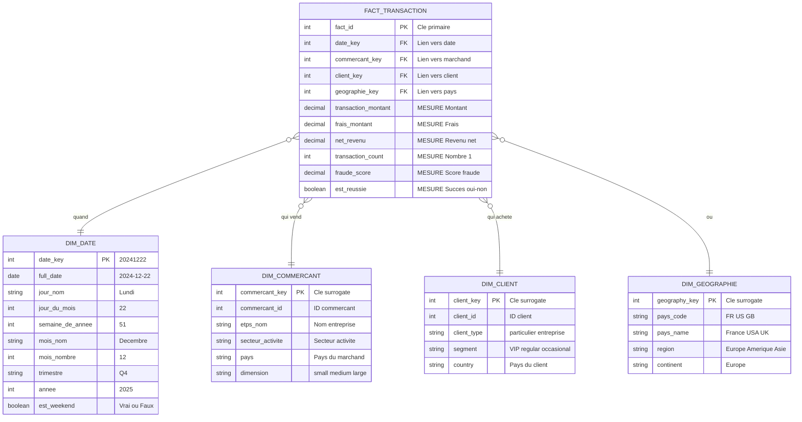

# Conception de schéma pour un système OLAP
## Le Système OLAP

### Qu'est-ce que l'OLAP ?

**OLAP = Online Analytical Processing**

C'est l'entrepôt de données pour les **analyses** :

- Quel est le chiffre d'affaires par pays ce mois ?
- Quels clients sont à risque de fraude ?
- Quelle est la tendance des abonnements ?

### Différence OLTP vs OLAP

| Aspect | OLTP | OLAP |
| ------ | ---- | ---- |
| **Usage** | Opérations quotidiennes | Analyses et rapports |
| **Requêtes** | Simples, rapides (< 10ms) | Complexes, longues (secondes) |
| **Volume** | Millions de lignes | Milliards de lignes |
| **Mise à jour** | En temps réel | Batch (quotidien) |
| **Structure** | Normalisée (3NF) | Dénormalisée (star schema) |

### Le schéma en étoile

**Concept** : Au centre les **MESURES**, autour le **CONTEXTE**

**Table de FAITS** = Les chiffres à analyser

- Combien ? → transaction_amount
- Quel revenu net ? → net_revenue
- Combien de transactions ? → transaction_count

**Tables de DIMENSIONS** = Le contexte pour filtrer

- Quand ? → DIM_DATE (année, mois, jour, trimestre)
- Qui ? → DIM_COMMERCANT, DIM_CUSTOMER
- Où ? → DIM_GEOGRAPHIE (pays, région)




### Exemple de requête analytique

Question : "Quel est le chiffre d'affaires par pays en décembre 2025 ?"

```sql
SELECT 
    g.pays_nom,
    SUM(f.revenu_net) as total_revenu,
    COUNT(f.transaction_count) as nb_transactions
FROM FACT_TRANSACTION f
JOIN DIM_GEOGRAPHIE g ON f.geographie_key = g.geographie_key
JOIN DIM_DATE d ON f.date_key = d.date_key
WHERE d.annee = 2025 
  AND d.mois_nombre = 12
GROUP BY g.pays_nom
ORDER BY total_revenu DESC;
```

**Résultat** :

| pays_nom | total_revenu | nb_transactions |
| ------------ | ------------- | ----------- |
| USA | 50,000,000 € | 2,500,000 |
| France | 12,000,000 € | 800,000 |
| UK | 8,500,000 € | 600,000 |

### Pourquoi dénormaliser en OLAP ?

**OLTP** : Normaliser pour éviter duplication
**OLAP** : Dénormaliser pour la **vitesse**